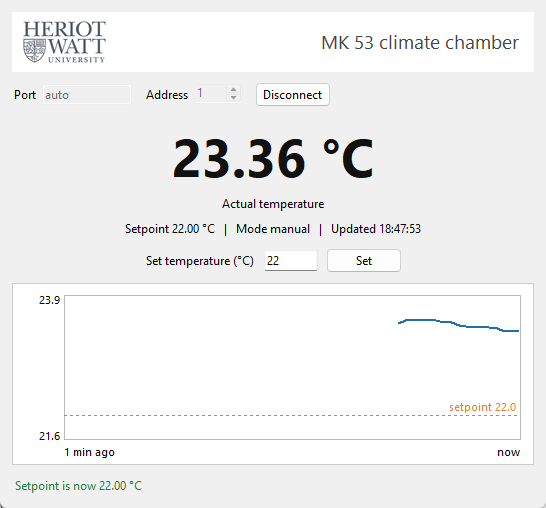
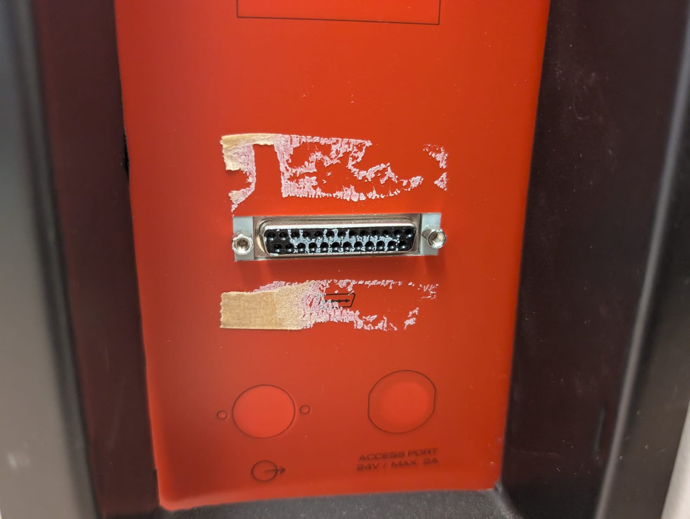
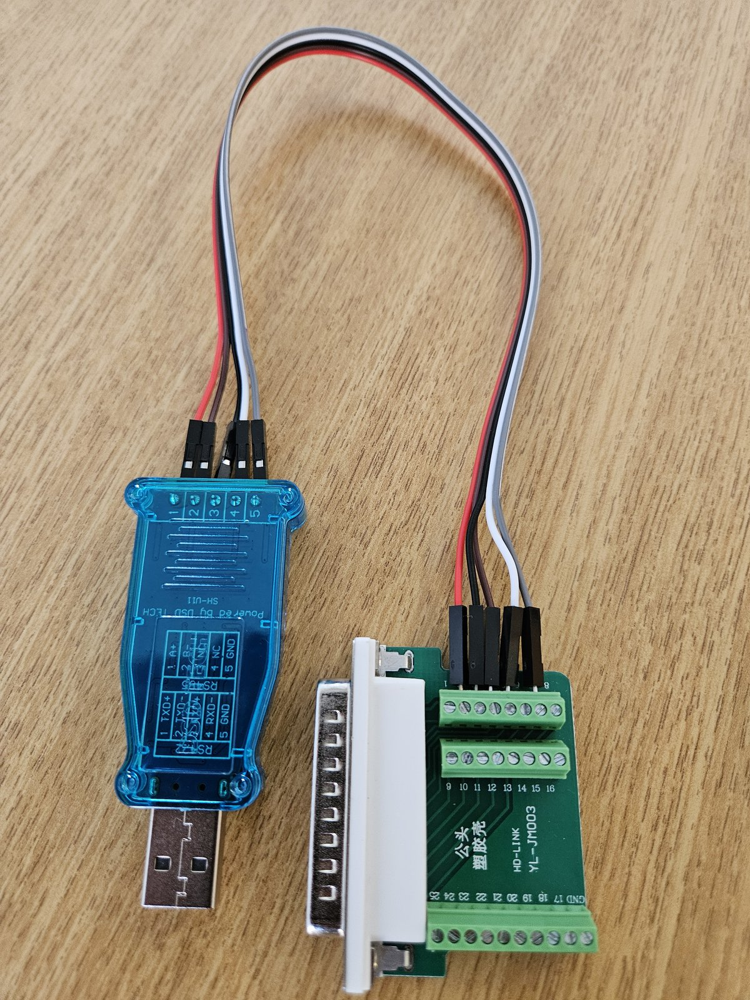

# BINDER MK 53 Climate Chamber Control over RS-422

Python tools to read and set the temperature of a BINDER MK 53 (E2.1) climate chamber from a Windows PC, through its RS-422 port and a low-cost USB adapter. Includes a Modbus RTU driver, command-line scripts and a small window that shows the temperature every second.



Tested on an MK 53 E2 (article 9120-0006, MB1 controller, built 2014) in the Heriot-Watt University lab, September 2026.

## What you need

| Part | Notes |
|---|---|
| BINDER MK 53 (E2.1) with MB1 controller | RS-422 port is the DB25 socket on the left side panel |
| USB to RS-422 adapter | Used here: DSD TECH SH-U11 (FTDI FT232R) |
| Male DB25 breakout with screw terminals | Used here: HD-LINK YL-JM003 |
| 5 jumper wires | Adapter terminals to breakout |
| Windows PC with Python 3.12 | Other systems should work but are untested |

## Wiring

Only five pins are used. The adapter's transmit pair goes to the chamber's receive pins and the other way round.

| DB25 pin | Chamber signal | SH-U11 terminal | Adapter label |
|---|---|---|---|
| 2 | RxD+ | 1 | TXD+ |
| 4 | RxD- | 2 | TXD- |
| 3 | TxD+ | 3 | RXD+ |
| 5 | TxD- | 4 | RXD- |
| 7 | Ground | 5 | GND |

Leave every other pin unconnected. These pins come from the BINDER operating manual (chapter 14.1) and the chamber's factory wiring diagram. Generic DB25 RS-422 tables found online use different pins, so do not use them.

<p>
  
  
</p>

## Settings

| Setting | Value |
|---|---|
| Serial | 9600 baud, 8 data bits, no parity, 1 stop bit |
| Protocol | Modbus RTU, functions 0x03 (read) and 0x10 (write) |
| Controller address | 1 by default (controller menu: Instrument data, Address) |

| Register | Content | Type |
|---|---|---|
| 0x11A9 | Actual temperature | float32, read |
| 0x1077 | Active setpoint | float32, read |
| 0x1581 | Manual mode setpoint | float32, write |
| 0x156F | Basic mode setpoint | float32, write |
| 0x1A22 | Operating mode (bit 10 programme, bit 11 manual, bit 12 basic) | uint16, read |

Floats are IEEE-754 with the two 16-bit words swapped (low word first). Source: BINDER Interface Technical Specifications, Art. No. 7001-0242, issue 10/2024.

## Install

```
git clone <this repository>
cd <repository folder>
py -3.12 -m venv .venv
.venv\Scripts\python.exe -m pip install -r requirements.txt
```

The FTDI driver usually installs itself when the adapter is plugged in. The scripts find the adapter by its USB identity, so you do not need its COM number. To choose a port yourself, add `--port COM5`.

## Use

```
.venv\Scripts\python.exe code\chamber_gui.py                 window: live temperature, trend, set box
.venv\Scripts\python.exe code\chamber_gui.py --demo          same window with a simulated chamber
.venv\Scripts\python.exe code\set_temperature.py             set 22 °C and confirm it
.venv\Scripts\python.exe code\set_temperature.py 30 --wait 20   set 30 °C and wait up to 20 min
.venv\Scripts\python.exe code\set_temperature.py --dry-run   show the state, write nothing
.venv\Scripts\python.exe code\check_connection.py            read-only connection test
.venv\Scripts\python.exe code\probe_link.py --loopback       test the adapter on its own
```

From Python:

```python
import sys; sys.path.insert(0, "code")
from mk53_driver import MK53, resolve_port

with MK53(resolve_port("auto"), slave_address=1) as chamber:
    print(chamber.get_temperature(), chamber.get_temperature_setpoint(), chamber.get_mode())
    chamber.set_temperature(22.0)
```

## Safety

- Setpoints outside -40 °C to +180 °C are refused before anything is sent.
- The scripts ask before writing while a temperature programme is running on the chamber.
- They never start an idle chamber. Start it at its own controller.
- Only one program can use the COM port at a time. Close the window before running a script.

## Tests

The tests use a simulated chamber and need no hardware:

```
.venv\Scripts\python.exe -m pip install -r requirements-dev.txt
.venv\Scripts\python.exe -m pytest
```

## Troubleshooting

| Symptom | Try |
|---|---|
| No FTDI adapter found | Plug in the adapter, or name the port with `--port` |
| Port opens but the chamber never replies | Check the five wires against the table above, then run `probe_link.py --loopback` with TX+ linked to RX+ and TX- to RX- on the adapter. The serial settings are fixed by BINDER, so changing baud rate or parity will not help. |
| Modbus error with a code | The chamber answered but refused the request. Check the controller address. |
| "Access is denied" | Another program has the port open, or the adapter was unplugged. The window reconnects by itself. |

## Repository layout

```
code/         driver (mk53_driver.py), scripts, window, tests, assets/
docs/         connection report (Markdown and PDF) and the script that builds the PDF
images/       photos of the chamber, the wiring and the window
datasheets/   BINDER documents, kept locally only (see datasheets/README.md)
```

The full account of how the connection was worked out, with sources, is in [docs/MK53_CONNECTION_REPORT.md](docs/MK53_CONNECTION_REPORT.md).

## Credits

Modbus framing follows the SiLab Bonn [basil](https://github.com/SiLab-Bonn/basil) Binder MK53 driver and [ecree-solarflare/ovenctl](https://github.com/ecree-solarflare/ovenctl). Register addresses and serial settings are confirmed against BINDER's own documents, supplied by BINDER Service.

## Licence

The code and documentation are released under the [MIT Licence](LICENSE). The Heriot-Watt University logo in `code/assets/` belongs to Heriot-Watt University and is not covered by the MIT Licence.

BINDER and MK 53 are trademarks of BINDER GmbH. This project is not affiliated with or endorsed by BINDER.
