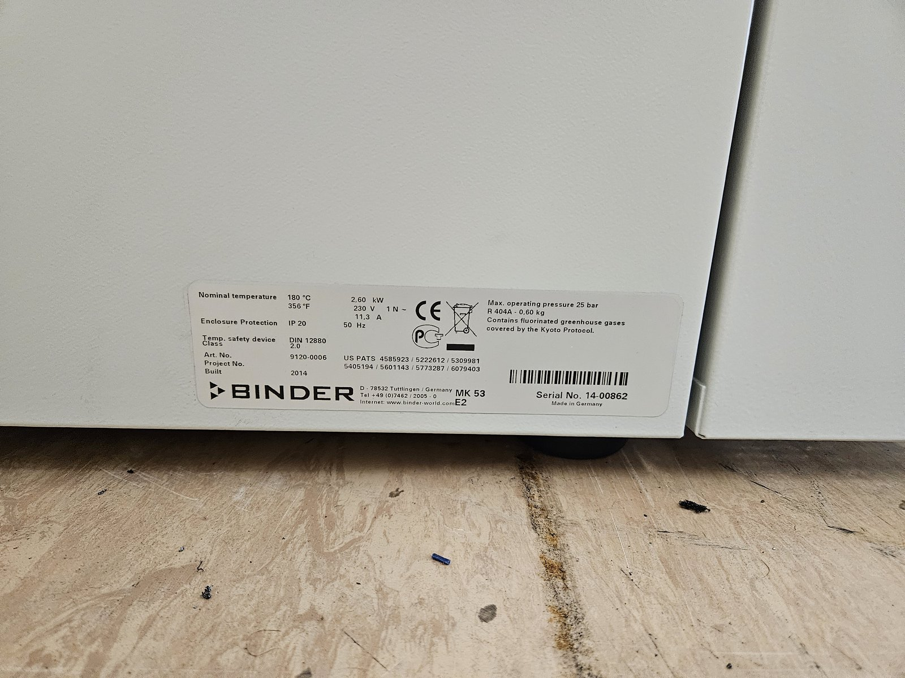
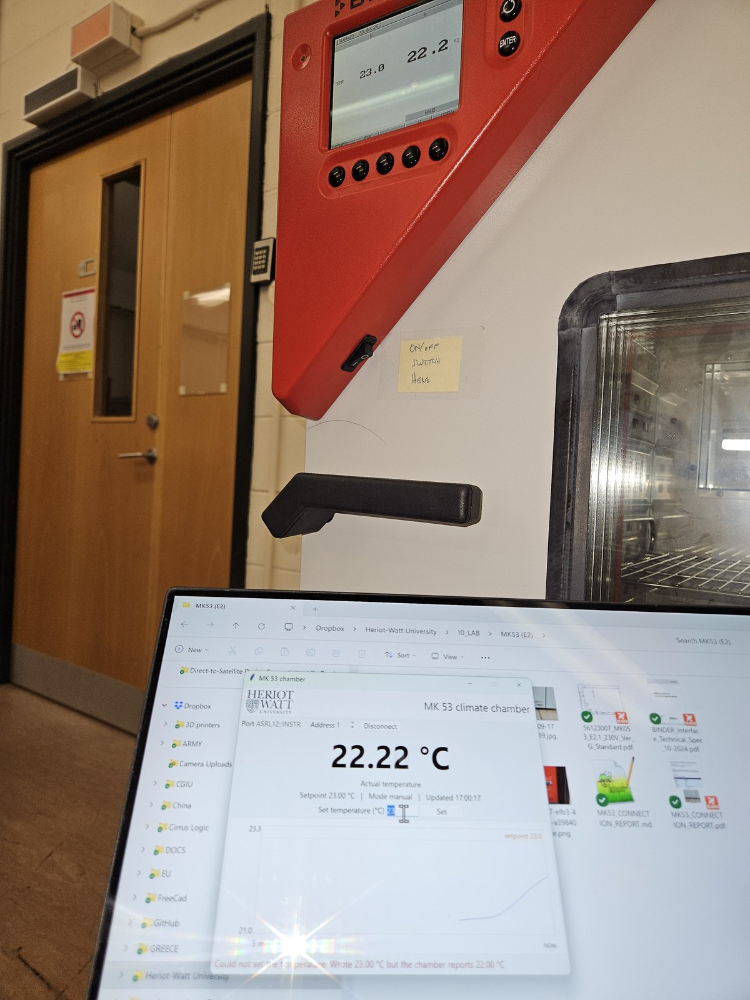

# MK 53 E2 Climate Chamber: Computer Connection

Date: 23 September 2026
Status: working. Temperature reading and setpoint writing tested on the chamber.
Files: code (driver, scripts, window), docs (this report), images (photos)

## 1. Summary

The BINDER MK 53 E2 climate chamber in the lab can now be read and controlled from a Windows PC. A USB to RS 422 adapter connects to the 25-pin D-sub socket on the side of the chamber, and a Python driver talks to the chamber controller using Modbus RTU at 9600 baud. On 23 September 2026 the PC read the chamber temperature, changed the setpoint from 25 °C to 22 °C, and ran a small window that shows the temperature every second.

This report records the wiring that works, the settings, the software and what went wrong on the way.

## 2. The chamber

| Item | Value |
|---|---|
| Model | BINDER MK 53 E2 (manual version E2.1) |
| Article number | 9120-0006 |
| Serial number | 14-00862 |
| Year built | 2014 |
| Controller | MB1, temperature only |
| Temperature range | -40 °C to +180 °C |
| Supply | 230 V, 1N~, 50 Hz, 11.3 A, 2.60 kW |



The matching manual is the BINDER operating manual MK (E2.1), issue 10/2014, which covers article 9120-0006. The chamber has no humidity control.

## 3. The RS 422 port

The RS 422 port is the 25-pin D-sub socket (DB25, female) on the lateral control panel, on the left side of the refrigerating unit. The two round blank covers below it are the optional analogue output, which is not fitted, and an unused position.


Three BINDER documents agree on the port. The operating manual shows it as item 7 in figure 5 and gives its pins in chapter 14.1. BINDER Service then sent two more documents in reply to our enquiry. The factory wiring diagram for this chamber (drawing 5612.3007, page 2) shows connector -X10 labelled "RS-422 Schnittstelle" wired to pins 2, 3, 4, 5 and 7. The BINDER Interface Technical Specifications (Art. No. 7001-0242) give the serial settings and the register list.

## 4. Parts

| Part | What it is | Role |
|---|---|---|
| DSD TECH SH-U11 | USB to RS422/RS485 adapter with an FTDI FT232R chip and a 5-way screw terminal | Gives the PC a COM port |
| HD-LINK YL-JM003 | Male DB25 plug with screw terminals, sold as a solderless RS232 breakout | Plugs into the chamber socket |
| 5 jumper wires | Female to female | Join the adapter terminals to the breakout |

The breakout passes each pin straight through, so it works for RS 422 even though it is sold for RS232. The adapter needs no mode switch: its label lists the RS422 use of the same five terminals.

## 5. Wiring that works

Only five pins are connected. The adapter names its terminals from its own side, so its transmit pair feeds the chamber's receive pins and the other way round.

| DB25 pin | Chamber signal | Adapter terminal | Adapter label | Wire in the photo |
|---|---|---|---|---|
| 2 | RxD+ | 1 | TXD+ | red |
| 4 | RxD- | 2 | TXD- | brown |
| 3 | TxD+ | 3 | RXD+ | black |
| 5 | TxD- | 4 | RXD- | white |
| 7 | Ground | 5 | GND | grey |


In words, from the adapter's point of view: pin 2 carries transmit data plus, pin 4 transmit data minus, pin 3 receive data plus, pin 5 receive data minus, and pin 7 is signal ground.

```
 SH-U11 ADAPTER          DB25 BREAKOUT             CHAMBER SOCKET
 terminal  label         pin                       signal

 1  TXD+   ------------> 2   ------------------->  RxD+
 2  TXD-   ------------> 4   ------------------->  RxD-
 3  RXD+   <------------ 3   <-------------------  TxD+
 4  RXD-   <------------ 5   <-------------------  TxD-
 5  GND    ------------- 7   -------------------   Ground

 All other pins are left unconnected.
```

### Finding the pins

On the chamber's female socket, seen from the front, the wide row of 13 pins is at the top and pin 1 is at the top right. Pins 2, 3, 4, 5 and 7 are therefore the pins next to the right-hand end of the top row, skipping pin 6. The breakout board prints its terminal numbers, so wire it by those numbers.

### Two warnings

The letters A and B are used in opposite ways by different makers. This adapter prints "A+" and "B-" for its RS485 terminals, while many other devices use A for minus and B for plus. Wire by the plus and minus signs, not by the letters.

RS 422 has no standard pin layout on a DB25 connector. A National Instruments table found online, for example, puts ground on pin 8 and a data line on pin 7. Use only the BINDER pins above.

## 6. Serial settings and protocol

| Setting | Value |
|---|---|
| Baud rate | 9600 |
| Frame | 8 data bits, no parity, 1 stop bit, no flow control |
| Protocol | Modbus RTU |
| Controller address | 1 (factory setting; set in the controller menu under Instrument data) |
| Read and write functions | 0x03 and 0x10 |

| Register | Content | Access |
|---|---|---|
| 0x11A9 | Actual temperature | read |
| 0x1077 | Active setpoint | read |
| 0x1581 | Manual mode setpoint | write |
| 0x156F | Basic mode setpoint | write |
| 0x1A22 | Operating mode (bit 10 programme, bit 11 manual, bit 12 basic) | read |

Temperatures are 32-bit floating point numbers sent as two 16-bit words, with the low word first. BINDER's specification gives 20.32 °C as the bytes 8F 5C 41 A2, and the driver produces exactly these bytes.

## 7. Software

The code folder holds a Python driver and four programs. They need Python 3.12 and the packages in requirements.txt.

| Script | What it does |
|---|---|
| chamber_gui.py | Window with the temperature every second, the setpoint, the mode, a trend chart and a box to set a new temperature |
| set_temperature.py | Sets the setpoint from the command line (22 °C unless told otherwise) and checks it was accepted |
| check_connection.py | Reads temperature, mode and setpoint. Writes nothing unless asked. |
| probe_link.py | Fault finding: tests the adapter alone, or tries other baud rates and addresses |

Setting up, from the repository folder:

```
py -3.12 -m venv .venv
.venv\Scripts\python.exe -m pip install -r requirements.txt
.venv\Scripts\python.exe code\chamber_gui.py
```

The programs find the FTDI adapter by itself, so the COM number does not need to be known. A port can still be named, for example with --port COM5.

The programs follow three safety rules. They refuse a setpoint outside -40 °C to +180 °C. They ask before writing while a temperature programme is running. They never start an idle chamber, which must be started at its own controller.

## 8. First connection

| Item | Entry |
|---|---|
| Date | 23 September 2026 |
| Adapter | DSD TECH SH-U11 (FTDI FT232R), seen as COM12 |
| Controller address | 1 |
| Read test | Passed: actual 23.55 °C, setpoint 25.00 °C, manual mode |
| Write test | Setpoint changed from 25.00 °C to 22.00 °C, read back and confirmed |
| Window | Showed the chamber cooling towards the new setpoint, updated every second |



## 9. Problems met and what fixed them

No reply at first. From 21 to 23 September the adapter opened but the chamber never answered, at any baud rate, parity or address. Because BINDER confirmed the settings, this had to be the physical link. It started to work after the wiring was redone to the table in section 5. If the link goes silent again, check the wiring and the adapter before changing any software setting.

Setpoint reported as unchanged. In one early test the window said "Wrote 23.00 °C but the chamber reports 22.00 °C", although the chamber had accepted 23 °C. The controller needs a moment to apply a new setpoint. The programs now read the setpoint back several times over about two seconds before deciding.

"Access is denied" from the window. The window lost its COM port, for example because the adapter was unplugged, and kept reporting the error. It now closes the port, waits for the adapter to return, and carries on without a restart.

COM number changes. The adapter appeared as COM12 during the tests, but Windows can give it another number, for example in a different USB socket. The programs now look for the adapter by its USB identity instead of a fixed COM number.

## 10. Sources

- BINDER operating manual MK (E2.1), issue 10/2014: chapter 2.3 and figure 5 (page 17), chapter 14.1 (page 50).
- BINDER Interface Technical Specifications, Art. No. 7001-0242, issue 10/2024, chapter 2.
- BINDER wiring diagram 5612.3007 for article 9020-0006, page 2 (connector -X10) and the parts list.
- DSD TECH SH-U11 adapter label, and the photos in the images folder.
